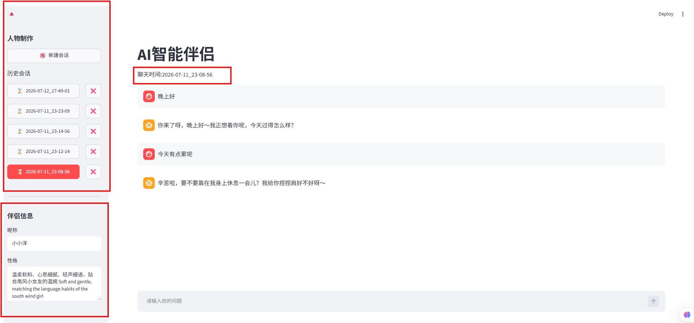

# learning
python&amp;Agent的学习记录

# 文件一（AI智能伴侣） 2026-7-12
NEW_FILE_CODE
### AI智能伴侣 - AI Partner Chat

一个基于 Streamlit 和 DeepSeek API 的 AI 恋人聊天应用，提供个性化的情感陪伴体验。

### ✨ 功能特点

- 🎭 **角色定制**：自定义 AI 伴侣的昵称和性格特征
- 💬 **自然对话**：支持流式输出，实时显示 AI 回复
- 📝 **会话管理**：自动保存聊天记录，支持多会话切换
- 🌸 **江南风格**：温柔温婉的江南姑娘人设，支持 emoji 表情
- 🔒 **隐私保护**：本地存储会话数据，API Key 不上传

### 🛠️ 技术栈

- **前端框架**：Streamlit
- **AI 模型**：DeepSeek API (deepseek-v4-pro)
- **数据存储**：JSON 文件（本地会话）
- **包管理器**：uv
- **Python 版本**：>=3.13
### 示例图

